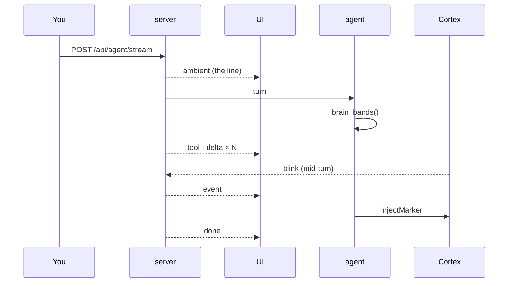

# What the agent sees

[brain: focus 0.71↑ · stress 0.22↓ · alpha dominant O1/O2 · still 38s · CQ 13/14 good]

`focus` attention (+ delta arrow) · `stress` · dominant band + top 2 channels · seconds still · electrodes at CQ 4.

It never mentions the line unless it matters. It changes behavior:

| you | it |
|---|---|
| stress ↑, task failed | 3 lines, 1 next step, no questions |
| focus dropped mid-answer | one-line summary |
| alpha up, still 40 s | shuts up |
| engagement rising | pulls the thread |
| CQ < 10/14 | normal assistant, says so |

## One turn

Every action stamps the EEG record → [the dataset](ecot.md).

## Consent, not steering

PUSH → YES
PULL → NO
CLENCH → VETO · ALWAYS

