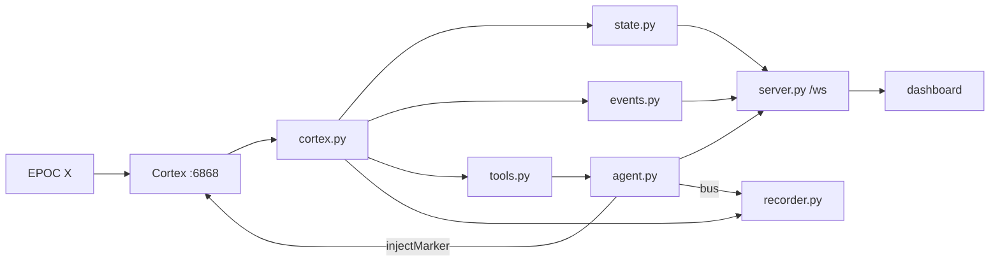

# Architecture

| module | does |
|---|---|
| `cortex.py` / `fake.py` | one Cortex session; `dev` always co-subscribed; fixture replay |
| `state.py` | ring buffers, bands, pose |
| `events.py` | debounced reflex events |
| `tools.py` | `@tool`s + `ambient_line()` |
| `agent.py` / `agent_api.py` | Strands agent, SSE streaming, markers |
| `recorder.py` / `dataset_v3.py` | LeRobot v3 writer (pyarrow) |
| `server.py` | FastAPI, WS fan-out, static |

**Measured limits:** Basic license denies `eeg` (`-32016`) → `pow` is the source. `attention` only when Cortex's detector is active → nothing gates on it. `fps=8` = `pow` rate.

## The mark

Green strand: the Strands agent. Teal strand: the person, with an EEG signal running along it and a marker stamped where the two cross.
