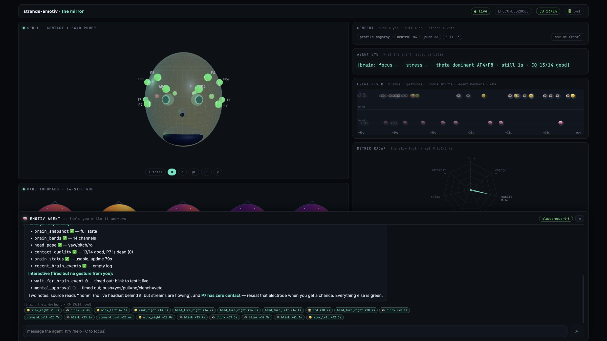
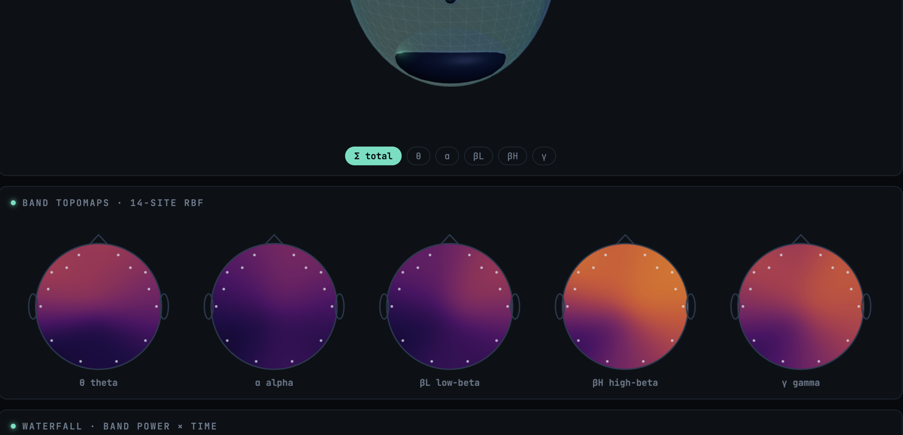
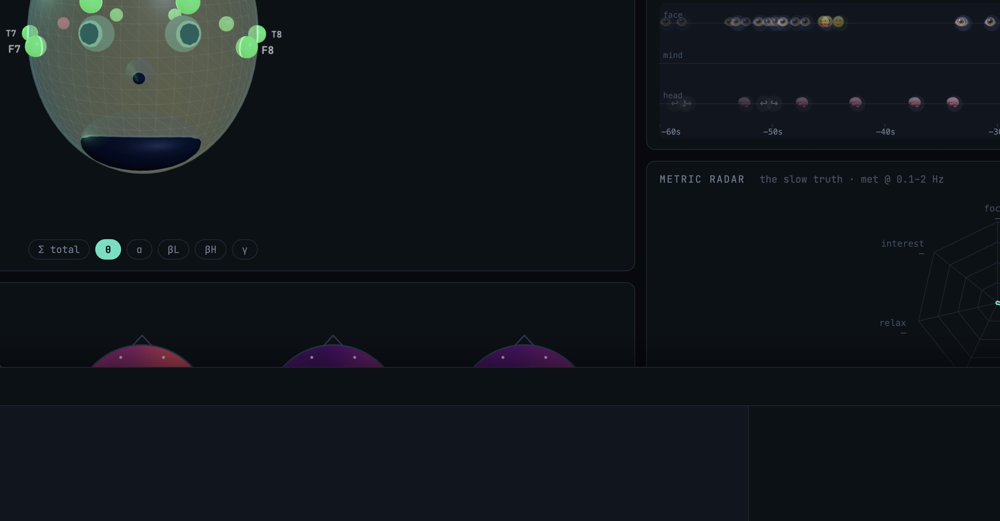
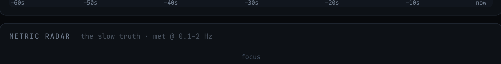

# Dashboard

You left, the agent right, the conversation below.

{ .screen }

## Left: you
{ .screen }

- **Skull**: turns with your head (32 Hz). 14 orbs: color = CQ, size = band power. Eyes flash on blink, jaw on clench.
- **Topomaps**: θ α βL βH γ over the scalp. Close your eyes: alpha blooms.
- **Waterfall**: 10 minutes of band power per channel.
- **Head trail**: where you looked.

{ .screen }

## Right: the agent
{ .screen }

- **Agent eye**: the exact line it reads. CQ < 10/14 → *"I can't see your brain right now."*
- **Event river**: blinks, clenches, turns flow left→right; the agent's markers land in the same river.
- **Metric radar**: 7 mood axes, fading ghosts (exc/lex 2 Hz, the rest ~10 s, each holds its last value). Missing stays missing, never `0.00`.
- **Sonify**: off by default. Alpha → drone, beta → tempo, blink → tick.
- **Consent**: `push = yes · pull = no · clench = veto`.

## Bottom: chat
Streams markdown. Under each message: the line the agent saw. Tool calls and mid-turn blinks become chips.

```bash
cd dashboard/frontend && npm i && npm run dev    # proxies /ws → :8765
```
