# The dataset

[Embodied chain-of-thought](https://arxiv.org/abs/2407.08693), brain edition:

| ECoT | here |
|---|---|
| camera | band power · CQ · motion · metrics · facial · events @ 8 Hz |
| reasoning | `TASK \| AMBIENT \| PLAN \| TOOL \| ACT \| REWARD` |
| gripper | **the agent's speech** |
| success | **your brain after the answer** (Δstress, Δengagement) |

An episode = 3 s before you speak → the streamed answer → 12 s after (catches the next `met` tick).



## A real frame

Every frame carries the whole turn as one task string. Decoded:

<div class="capsule" aria-label="one ECoT frame, decoded">
<div class="capsule-head">frame 80 · <code>task</code> string · decoded</div>
<div class="capsule-row"><span class="cap-key k-task">TASK</span><span>One sentence: how does my brain look right now?</span></div>
<div class="capsule-row"><span class="cap-key k-ambient">AMBIENT</span><span>[brain: theta dominant · CQ 13/14 good]</span></div>
<div class="capsule-row"><span class="cap-key k-plan">PLAN</span><span>Calm and settled: theta's leading with solid contact…</span></div>
<div class="capsule-row"><span class="cap-key k-tool">TOOL</span><span>none</span></div>
<div class="capsule-row"><span class="cap-key k-act">ACT</span><span>Calm and settled…</span></div>
<div class="capsule-row"><span class="cap-key k-reward">REWARD</span><span>Δstress=nan, Δengagement=nan</span></div>
</div>

(`nan` is honest: `met` at 0.1 Hz didn't land inside that 12 s episode.)

## Use it

```python
from lerobot.datasets.lerobot_dataset import LeRobotDataset
ds = LeRobotDataset("cagataydev/emotiv-ecot")   # private
ds[80]["observation.state"].shape               # [70]
ds[80]["task"]                                  # the string above
```

**● REC** → talk → **Publish**. Or `strands-emotiv record ambient --minutes 10` for baselines.

Full schema: [DATASET.md](DATASET.md).
