<canvas id="eeg-hero" aria-hidden="true"></canvas>

# An agent that can feel you

EPOC X → Cortex → Strands tools · live dashboard · LeRobot v3 datasets.

<iframe src="https://www.youtube-nocookie.com/embed/eGYnLK_RREM" title="I put my brain on a dashboard and gave my AI agent a nervous system" frameborder="0" allow="accelerometer; autoplay; clipboard-write; encrypted-media; gyroscope; picture-in-picture" allowfullscreen></iframe>

1:40: how it works

The agent gets one line per turn. You see the same line:

[brain: stress 0.45↑ · theta dominant · still 12s · CQ 13/14 good]

EPOC&nbsp;X ▸ dongle ▸ Cortex <code>wss:6868</code> ▸ relay <code>:8765</code> ▸ dashboard&nbsp;+&nbsp;agent

θ theta
α alpha
β low
β high
γ gamma
The five bands the dashboard streams at 8&nbsp;Hz. This site uses their colors.

- :material-rocket-launch: **[Quickstart](quickstart.md)**: headset on, dongle in, four commands.
- :material-mirror: **[Dashboard](dashboard.md)**: left is you, right is the agent, bottom is chat.
- :material-brain: **[Dataset](ecot.md)**: brain as observation and reward.
- :material-scale-balance: **[Design rules](soul.md)**

