# Quickstart

**Need:** EPOC X + its **USB dongle** (cable = charge only) · EMOTIV Launcher running · free dev app at [emotiv.com/developer](https://www.emotiv.com/developer/) · Python 3.12 + `uv`.



```bash
git clone https://github.com/cagataycali/strands-emotiv && cd strands-emotiv
printf "EMOTIV_CLIENT_ID=…\nEMOTIV_CLIENT_SECRET=…\n" > .env
uv sync
uv run strands-emotiv doctor       # Cortex ✓ · headset ✓ · streams ✓
uv run strands-emotiv dashboard    # → http://localhost:8765
```

Hydrate the felts and watch `CQ` climb to 14/14. Blink, and the skull's eyes flash.

No headset? `strands-emotiv dashboard --fake` replays 865 real samples.

## What the Basic license gives you

| stream | Hz | used for |
|---|---|---|
| `pow` | 8 | band power θ α βL βH γ × 14 (the main input) |
| `met` | 2 / 0.1 | engagement · stress · relaxation · interest (attention: sometimes) |
| `fac` | 32 | blink · wink · clench · smile |
| `mot` | 32 | head pose |
| `com` | 8 | trained mental commands |
| `dev` | 2 | contact quality, battery |
| `eeg` | n/a | raw waveform, needs EmotivPRO. Not required. |
