# Raw wire

`strands_emotiv/fixtures/epocx_live_10s.jsonl`: 865 real samples over 10 s. Each line is `{stream, time, data}`.

<div class="capsule" aria-label="stream matrix">
<div class="capsule-head">streams on the wire · from the 10 s fixture</div>
<div class="capsule-row"><span class="cap-key k-ambient">pow</span><span>band power: 70 values (14 ch × 5 bands) @ 8 Hz</span></div>
<div class="capsule-row"><span class="cap-key k-act">fac</span><span>facial: blink, brow, jaw (<code>eyeAct</code>/<code>uAct</code>/<code>lAct</code>)</span></div>
<div class="capsule-row"><span class="cap-key k-task">mot</span><span>motion: quaternion Q0…Q3 + accel/mag</span></div>
<div class="capsule-row"><span class="cap-key k-plan">met</span><span>metrics: exc at 2 Hz, eng/str/rel… every ~10 s (merge, never replace)</span></div>
<div class="capsule-row"><span class="cap-key k-tool">dev</span><span>contact quality: battery + per-electrode 0 to 4</span></div>
</div>

```jsonc
{"stream":"fac","time":1788320367.4832,"data":{"eyeAct":"blink","uAct":"neutral","lAct":"neutral"}}
{"stream":"mot","time":1788320367.4832,"data":{"Q0":0.7211,"Q1":0.2606,"Q2":-0.6166,"Q3":0.1787, …}}
{"stream":"pow","time":1788320367.55,  "data":{"AF3/theta":9.184,"AF3/alpha":1.084, …}}     // 70 @ 8 Hz
{"stream":"met","time":1788320377.4151,"data":{"eng":0.790,"str":0.393,"rel":0.300, …}}     // slow keys ~10 s, exc 2 Hz
{"stream":"dev","time": …,              "data":{"battery":75,"AF3":4,"F7":4, …,"FC6":1}}     // contact
```


Channel order everywhere:

<p class="electrodes" aria-label="14 electrode channel order">
<span>AF3</span><span>F7</span><span>F3</span><span>FC5</span><span>T7</span><span>P7</span><span>O1</span><span>O2</span><span>P8</span><span>T8</span><span>FC6</span><span>F4</span><span>F8</span><span>AF4</span>
</p>


